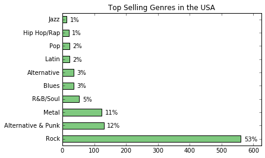
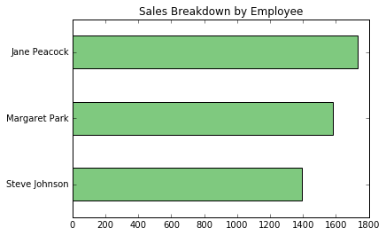
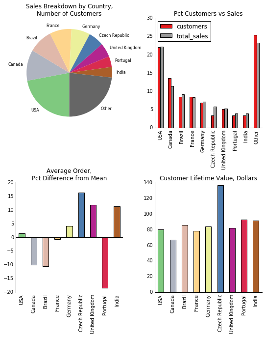

# Dataquest Guided Project: Answering Business Questions using SQL
In this guided project, we're going to practice using our SQL skills to answer business questions. In each step, we'll give you a task, and you'll need to:

* Write a SQL query to extract the relevant data
* Create plots where necessary to visualize the data
* Write a short paragraph, drawing conclusions and explaining the data and/or visualizations.

We'll continue to use the Chinook database that we've used in earlier missions of this course. The Chinook database is provided as a SQLite database file called chinook.db. A copy of the database schema is below - you'll need to come back to this step often to consult the schema as you write your queries.

https://s3.amazonaws.com/dq-content/191/chinook-schema.svg

## Creating Helper Functions


```python
import sqlite3
import pandas as pd
import numpy as np
import matplotlib.pyplot as plt
from matplotlib import cm
%matplotlib inline

db = 'chinook.db'

def run_query(q):
    with sqlite3.connect(db) as conn:
        return pd.read_sql(q, conn)

def run_command(c):
    with sqlite3.connect(db) as conn:
        conn.isolation_level = None
        conn.execute(c)

def show_tables():
    q = '''
    SELECT
        name,
        type
    FROM sqlite_master
    WHERE type IN ("table","view");
    '''
    return run_query(q)

show_tables()
```


<div>
<style scoped>
    .dataframe tbody tr th:only-of-type {
        vertical-align: middle;
    }

    .dataframe tbody tr th {
        vertical-align: top;
    }

    .dataframe thead th {
        text-align: right;
    }
</style>
<table border="1" class="dataframe">
  <thead>
    <tr style="text-align: right;">
      <th></th>
      <th>name</th>
      <th>type</th>
    </tr>
  </thead>
  <tbody>
    <tr>
      <th>0</th>
      <td>album</td>
      <td>table</td>
    </tr>
    <tr>
      <th>1</th>
      <td>artist</td>
      <td>table</td>
    </tr>
    <tr>
      <th>2</th>
      <td>customer</td>
      <td>table</td>
    </tr>
    <tr>
      <th>3</th>
      <td>employee</td>
      <td>table</td>
    </tr>
    <tr>
      <th>4</th>
      <td>genre</td>
      <td>table</td>
    </tr>
    <tr>
      <th>5</th>
      <td>invoice</td>
      <td>table</td>
    </tr>
    <tr>
      <th>6</th>
      <td>invoice_line</td>
      <td>table</td>
    </tr>
    <tr>
      <th>7</th>
      <td>media_type</td>
      <td>table</td>
    </tr>
    <tr>
      <th>8</th>
      <td>playlist</td>
      <td>table</td>
    </tr>
    <tr>
      <th>9</th>
      <td>playlist_track</td>
      <td>table</td>
    </tr>
    <tr>
      <th>10</th>
      <td>track</td>
      <td>table</td>
    </tr>
  </tbody>
</table>
</div>


## Selecting New Albums to Purchase
The Chinook record store has just signed a deal with a new record label, and you've been tasked with selecting the first three albums that will be added to the store, from a list of four. All four albums are by artists that don't have any tracks in the store right now - we have the artist names, and the genre of music they produce:


|Artist Name |Genre |
|--------------|-----|
|Regal|Hip-Hop|
|Red Tone|Punk|
|Meteor and the Girls|Pop|
|Slim Jim Bites|Blues|


The record label specializes in artists from the USA, and they have given Chinook some money to advertise the new albums in the USA, so we're interested in finding out which genres sell the best in the USA.

You'll need to write a query to find out which genres sell the most tracks in the USA, and then create a visualization of that data using pandas.

You can run the run_query() function twice. Once at the end of a cell to display the results, and then a second time to assign the output of yours to a variable name:

**genre_sales_usa = run_query(q)**

You can then use the **DataFrame.plot()** method or any of the other pandas plotting methods to produce your visualization. You can choose the sort of plot you think best communicates the data, but if you're stuck, a bar plot or horizontal bar plot will work well.

Note that if you use the **DataFrame.set_index()** method before you create your plot, your axis labels will be automatically added to your plot as shown in this blogpost.

Lastly, you should write up a summary of your findings, and make a recommendation for the three artists whose albums we should purchase for the store.


```python
albums_to_purchase = '''
WITH usa_tracks_sold AS
   (
    SELECT il.* FROM invoice_line il
    INNER JOIN invoice i on il.invoice_id = i.invoice_id
    INNER JOIN customer c on i.customer_id = c.customer_id
    WHERE c.country = "USA"
   )

SELECT
    g.name genre,
    count(uts.invoice_line_id) tracks_sold,
    cast(count(uts.invoice_line_id) AS FLOAT) / (
        SELECT COUNT(*) from usa_tracks_sold
    ) percentage_sold
FROM usa_tracks_sold uts
INNER JOIN track t on t.track_id = uts.track_id
INNER JOIN genre g on g.genre_id = t.genre_id
GROUP BY 1
ORDER BY 2 DESC
LIMIT 10;
'''

run_query(albums_to_purchase)
```


<div>
<style scoped>
    .dataframe tbody tr th:only-of-type {
        vertical-align: middle;
    }

    .dataframe tbody tr th {
        vertical-align: top;
    }

    .dataframe thead th {
        text-align: right;
    }
</style>
<table border="1" class="dataframe">
  <thead>
    <tr style="text-align: right;">
      <th></th>
      <th>genre</th>
      <th>tracks_sold</th>
      <th>percentage_sold</th>
    </tr>
  </thead>
  <tbody>
    <tr>
      <th>0</th>
      <td>Rock</td>
      <td>561</td>
      <td>0.533777</td>
    </tr>
    <tr>
      <th>1</th>
      <td>Alternative &amp; Punk</td>
      <td>130</td>
      <td>0.123692</td>
    </tr>
    <tr>
      <th>2</th>
      <td>Metal</td>
      <td>124</td>
      <td>0.117983</td>
    </tr>
    <tr>
      <th>3</th>
      <td>R&amp;B/Soul</td>
      <td>53</td>
      <td>0.050428</td>
    </tr>
    <tr>
      <th>4</th>
      <td>Blues</td>
      <td>36</td>
      <td>0.034253</td>
    </tr>
    <tr>
      <th>5</th>
      <td>Alternative</td>
      <td>35</td>
      <td>0.033302</td>
    </tr>
    <tr>
      <th>6</th>
      <td>Latin</td>
      <td>22</td>
      <td>0.020932</td>
    </tr>
    <tr>
      <th>7</th>
      <td>Pop</td>
      <td>22</td>
      <td>0.020932</td>
    </tr>
    <tr>
      <th>8</th>
      <td>Hip Hop/Rap</td>
      <td>20</td>
      <td>0.019029</td>
    </tr>
    <tr>
      <th>9</th>
      <td>Jazz</td>
      <td>14</td>
      <td>0.013321</td>
    </tr>
  </tbody>
</table>
</div>


```python
genre_sales_usa = run_query(albums_to_purchase)
genre_sales_usa.set_index("genre", inplace=True, drop=True)

genre_sales_usa["tracks_sold"].plot.barh(
    title="Top Selling Genres in the USA",
    xlim=(0, 625),
    colormap=plt.cm.Accent
)

plt.ylabel('')

for i, label in enumerate(list(genre_sales_usa.index)):
    score = genre_sales_usa.loc[label, "tracks_sold"]
    label = (genre_sales_usa.loc[label, "percentage_sold"] * 100
            ).astype(int).astype(str) + "%"
    plt.annotate(str(label), (score + 10, i - 0.15))

plt.show()
```





Based on the sales of tracks across different genres in the USA, we should purchase the new albums by the following artists:

Red Tone (Punk)
Slim Jim Bites (Blues)
Meteor and the Girls (Pop)
It's worth keeping in mind that combined, these three genres only make up only 17% of total sales, so we should be on the lookout for artists and albums from the 'rock' genre, which accounts for 53% of sales.

## Analyzing Employee Sales Performance
Each customer for the Chinook store gets assigned to a sales support agent within the company when they first make a purchase. You have been asked to analyze the purchases of customers belonging to each employee to see if any sales support agent is performing either better or worse than the others.

You might like to consider whether any extra columns from the employee table explain any variance you see, or whether the variance might instead be indicative of employee performance.


```python
employee_sales_performance = '''
WITH customer_support_rep_sales AS
    (
     SELECT
         i.customer_id,
         c.support_rep_id,
         SUM(i.total) total
     FROM invoice i
     INNER JOIN customer c ON i.customer_id = c.customer_id
     GROUP BY 1,2
    )

SELECT
    e.first_name || " " || e.last_name employee,
    e.hire_date,
    SUM(csrs.total) total_sales
FROM customer_support_rep_sales csrs
INNER JOIN employee e ON e.employee_id = csrs.support_rep_id
GROUP BY 1;
'''

run_query(employee_sales_performance)
```


<div>
<style scoped>
    .dataframe tbody tr th:only-of-type {
        vertical-align: middle;
    }

    .dataframe tbody tr th {
        vertical-align: top;
    }

    .dataframe thead th {
        text-align: right;
    }
</style>
<table border="1" class="dataframe">
  <thead>
    <tr style="text-align: right;">
      <th></th>
      <th>employee</th>
      <th>hire_date</th>
      <th>total_sales</th>
    </tr>
  </thead>
  <tbody>
    <tr>
      <th>0</th>
      <td>Jane Peacock</td>
      <td>2017-04-01 00:00:00</td>
      <td>1731.51</td>
    </tr>
    <tr>
      <th>1</th>
      <td>Margaret Park</td>
      <td>2017-05-03 00:00:00</td>
      <td>1584.00</td>
    </tr>
    <tr>
      <th>2</th>
      <td>Steve Johnson</td>
      <td>2017-10-17 00:00:00</td>
      <td>1393.92</td>
    </tr>
  </tbody>
</table>
</div>


```python
employee_sales = run_query(employee_sales_performance)

employee_sales.set_index("employee", drop=True, inplace=True)
employee_sales.sort_values("total_sales", inplace=True)
employee_sales.plot.barh(
    legend=False,
    title='Sales Breakdown by Employee',
    colormap=plt.cm.Accent
)
plt.ylabel('')
plt.show()
```





## Analyzing Sales by Country
Your next task is to analyze the sales data for customers from each different country. You have been given guidance to use the country value from the customers table, and ignore the country from the billing address in the invoice table.

In particular, you have been directed to calculate data, for each country, on the:

* ** total number of customers**
* ** total value of sales **
* ** average value of sales per customer **
* ** average order value **

Because there are a number of countries with only one customer, you should group these customers as "Other" in your analysis. You can use the following 'trick' to force the ordering of "Other" to last in your analysis.

If there is a particular value that you would like to force to the top or bottom of results, you can put what would normally be your most outer query in a subquery with a case statement that adds a numeric column, and then in the outer query sort by that column.


```python
sales_by_country = '''
WITH country_or_other AS
    (
     SELECT
       CASE
           WHEN (
                 SELECT count(*)
                 FROM customer
                 where country = c.country
                ) = 1 THEN "Other"
           ELSE c.country
       END AS country,
       c.customer_id,
       il.*
     FROM invoice_line il
     INNER JOIN invoice i ON i.invoice_id = il.invoice_id
     INNER JOIN customer c ON c.customer_id = i.customer_id
    )

SELECT
    country,
    customers,
    total_sales,
    average_order,
    customer_lifetime_value
FROM
    (
    SELECT
        country,
        count(distinct customer_id) customers,
        SUM(unit_price) total_sales,
        SUM(unit_price) / count(distinct customer_id) customer_lifetime_value,
        SUM(unit_price) / count(distinct invoice_id) average_order,
        CASE
            WHEN country = "Other" THEN 1
            ELSE 0
        END AS sort
    FROM country_or_other
    GROUP BY country
    ORDER BY sort ASC, total_sales DESC
    );
'''

run_query(sales_by_country)
```


<div>
<style scoped>
    .dataframe tbody tr th:only-of-type {
        vertical-align: middle;
    }

    .dataframe tbody tr th {
        vertical-align: top;
    }

    .dataframe thead th {
        text-align: right;
    }
</style>
<table border="1" class="dataframe">
  <thead>
    <tr style="text-align: right;">
      <th></th>
      <th>country</th>
      <th>customers</th>
      <th>total_sales</th>
      <th>average_order</th>
      <th>customer_lifetime_value</th>
    </tr>
  </thead>
  <tbody>
    <tr>
      <th>0</th>
      <td>USA</td>
      <td>13</td>
      <td>1040.49</td>
      <td>7.942672</td>
      <td>80.037692</td>
    </tr>
    <tr>
      <th>1</th>
      <td>Canada</td>
      <td>8</td>
      <td>535.59</td>
      <td>7.047237</td>
      <td>66.948750</td>
    </tr>
    <tr>
      <th>2</th>
      <td>Brazil</td>
      <td>5</td>
      <td>427.68</td>
      <td>7.011148</td>
      <td>85.536000</td>
    </tr>
    <tr>
      <th>3</th>
      <td>France</td>
      <td>5</td>
      <td>389.07</td>
      <td>7.781400</td>
      <td>77.814000</td>
    </tr>
    <tr>
      <th>4</th>
      <td>Germany</td>
      <td>4</td>
      <td>334.62</td>
      <td>8.161463</td>
      <td>83.655000</td>
    </tr>
    <tr>
      <th>5</th>
      <td>Czech Republic</td>
      <td>2</td>
      <td>273.24</td>
      <td>9.108000</td>
      <td>136.620000</td>
    </tr>
    <tr>
      <th>6</th>
      <td>United Kingdom</td>
      <td>3</td>
      <td>245.52</td>
      <td>8.768571</td>
      <td>81.840000</td>
    </tr>
    <tr>
      <th>7</th>
      <td>Portugal</td>
      <td>2</td>
      <td>185.13</td>
      <td>6.383793</td>
      <td>92.565000</td>
    </tr>
    <tr>
      <th>8</th>
      <td>India</td>
      <td>2</td>
      <td>183.15</td>
      <td>8.721429</td>
      <td>91.575000</td>
    </tr>
    <tr>
      <th>9</th>
      <td>Other</td>
      <td>15</td>
      <td>1094.94</td>
      <td>7.448571</td>
      <td>72.996000</td>
    </tr>
  </tbody>
</table>
</div>


## Visualizing Sales by Country
Now that we have our data, we've been asked to create a series of visualizations which communicate our findings, and then make recommendations on which countries may have potential for growth, so the Chinook marketing team can create some new advertising campaigns.

When we're working with data that has many dimensions, it can be tempting to try and communicate every dimension in a single plot. This often results in complex and hard to read visualizations. Instead of this, we should create different plots for each dimension.

Think about the best way to communicate the data - this includes not only plot types, but how you use color, spacing and layout. As an example, you might decide to use the same color across your four plots to represent each country, so it's easier to understand the chart as a whole.


```python
country_metrics = run_query(sales_by_country)
country_metrics.set_index("country", drop=True, inplace=True)
colors = [plt.cm.Accent(i) for i in np.linspace(0, 1, country_metrics.shape[0])]

fig, axes = plt.subplots(nrows=2, ncols=2, figsize=(9, 10))
ax1, ax2, ax3, ax4 = axes.flatten()
fig.subplots_adjust(hspace=.5, wspace=.3)


# top left
sales_breakdown = country_metrics["total_sales"].copy().rename('')
sales_breakdown.plot.pie(
    ax=ax1,
    startangle=-90,
    counterclock=False,
    title='Sales Breakdown by Country,\nNumber of Customers',
    colormap=plt.cm.Accent,
    fontsize=8,
    wedgeprops={'linewidth':0}
    
)

# top right
cvd_cols = ["customers","total_sales"]
custs_vs_dollars = country_metrics[cvd_cols].copy()
custs_vs_dollars.index.name = ''
for c in cvd_cols:
    custs_vs_dollars[c] /= custs_vs_dollars[c].sum() / 100
custs_vs_dollars.plot.bar(
    ax=ax2,
    colormap=plt.cm.Set1,
    title="Pct Customers vs Sales"
)
ax2.tick_params(top="off", right="off", left="off", bottom="off")
ax2.spines["top"].set_visible(False)
ax2.spines["right"].set_visible(False)


# bottom left
avg_order = country_metrics["average_order"].copy()
avg_order.index.name = ''
difference_from_avg = avg_order * 100 / avg_order.mean() - 100
difference_from_avg.drop("Other", inplace=True)
difference_from_avg.plot.bar(
    ax=ax3,
    color=colors,
    title="Average Order,\nPct Difference from Mean"
)
ax3.tick_params(top="off", right="off", left="off", bottom="off")
ax3.axhline(0, color='k')
ax3.spines["top"].set_visible(False)
ax3.spines["right"].set_visible(False)
ax3.spines["bottom"].set_visible(False)

# bottom right
ltv = country_metrics["customer_lifetime_value"].copy()
ltv.index.name = ''
ltv.drop("Other",inplace=True)
ltv.plot.bar(
    ax=ax4,
    color=colors,
    title="Customer Lifetime Value, Dollars"
)
ax4.tick_params(top="off", right="off", left="off", bottom="off")
ax4.spines["top"].set_visible(False)
ax4.spines["right"].set_visible(False)

plt.show()
```





Based on the data, there may be opportunity in the following countries:

Czech Republic
United Kingdom
India
It's worth keeping in mind that because the amount of data from each of these countries is relatively low. Because of this, we should be cautious spending too much money on new marketing campaigns, as the sample size is not large enough to give us high confidence. A better approach would be to run small campaigns in these countries, collecting and analyzing the new customers to make sure that these trends hold with new customers.

## Albums vs Individual Tracks
The Chinook store is setup in a way that allows customer to make purchases in one of the two ways:

* ** purchase a whole album **
* ** purchase a collection of one or more individual tracks. **

The store does not let customers purchase a whole album, and then add individual tracks to that same purchase (unless they do that by choosing each track manually). When customers purchase albums they are charged the same price as if they had purchased each of those tracks separately.

Management are currently considering changing their purchasing strategy to save money. The strategy they are considering is to purchase only the most popular tracks from each album from record companies, instead of purchasing every track from an album.

We have been asked to find out what percentage of purchases are individual tracks vs whole albums, so that management can use this data to understand the effect this decision might have on overall revenue.

It is very common when you are performing an analysis to have 'edge cases' which prevent you from getting a 100% accurate answer to your question. In this instance, we have two edge cases to consider:

Albums that have only one or two tracks are likely to be purchased by customers as part of a collection of individual tracks.
Customers may decide to manually select every track from an album, and then add a few individual tracks from other albums to their purchase.
In the first case, since our analysis is concerned with maximizing revenue we can safely ignore albums consisting of only a few tracks. The company has previously done analysis to confirm that the second case does not happen often, so we can ignore this case also.

In order to answer the question, we're going to have to identify whether each invoice has all the tracks from an album. We can do this by getting the list of tracks from an invoice and comparing it to the list of tracks from an album. We can find the album to compare the purchase to by looking up the album that one of the purchased tracks belongs to. It doesn't matter which track we pick, since if it's an album purchase, that album will be the same for all tracks


```python
albums_vs_tracks = '''
WITH invoice_first_track AS
    (
     SELECT
         il.invoice_id invoice_id,
         MIN(il.track_id) first_track_id
     FROM invoice_line il
     GROUP BY 1
    )

SELECT
    album_purchase,
    COUNT(invoice_id) number_of_invoices,
    CAST(count(invoice_id) AS FLOAT) / (
                                         SELECT COUNT(*) FROM invoice
                                      ) percent
FROM
    (
    SELECT
        ifs.*,
        CASE
            WHEN
                 (
                  SELECT t.track_id FROM track t
                  WHERE t.album_id = (
                                      SELECT t2.album_id FROM track t2
                                      WHERE t2.track_id = ifs.first_track_id
                                     ) 

                  EXCEPT 

                  SELECT il2.track_id FROM invoice_line il2
                  WHERE il2.invoice_id = ifs.invoice_id
                 ) IS NULL
             AND
                 (
                  SELECT il2.track_id FROM invoice_line il2
                  WHERE il2.invoice_id = ifs.invoice_id

                  EXCEPT 

                  SELECT t.track_id FROM track t
                  WHERE t.album_id = (
                                      SELECT t2.album_id FROM track t2
                                      WHERE t2.track_id = ifs.first_track_id
                                     ) 
                 ) IS NULL
             THEN "yes"
             ELSE "no"
         END AS "album_purchase"
     FROM invoice_first_track ifs
    )
GROUP BY album_purchase;
'''

run_query(albums_vs_tracks)
```


<div>
<style scoped>
    .dataframe tbody tr th:only-of-type {
        vertical-align: middle;
    }

    .dataframe tbody tr th {
        vertical-align: top;
    }

    .dataframe thead th {
        text-align: right;
    }
</style>
<table border="1" class="dataframe">
  <thead>
    <tr style="text-align: right;">
      <th></th>
      <th>album_purchase</th>
      <th>number_of_invoices</th>
      <th>percent</th>
    </tr>
  </thead>
  <tbody>
    <tr>
      <th>0</th>
      <td>no</td>
      <td>500</td>
      <td>0.814332</td>
    </tr>
    <tr>
      <th>1</th>
      <td>yes</td>
      <td>114</td>
      <td>0.185668</td>
    </tr>
  </tbody>
</table>
</div>


Album purchases account for 18.6% of purchases. Based on this data, I would recommend against purchasing only select tracks from albums from record companies, since there is potential to lose one fifth of revenue.


```python

```
